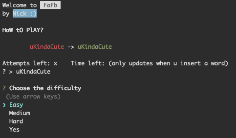

# Fast as Fucc: ⌨️ A Fast-Paced Typing Game

<p align="center">
  
</p>


### 💻 Installation:

Fast as Fucc is built using Node.js, so make sure you have it installed on your machine. If you don't have it yet, don't worry! You can grab the latest version here. Once you have Node.js ready, run the following command to install and play:

```
npx fafb
```

### 🎲 The Game

  - Choose between four difficulties. (This changes the amount of words, time, and amount of possible mistakes)
  - Every written word will change from red to green.
  - If the time or the mistakes reach 0, you lose.
  - Write every word before the time runs out to win.
  - GLHF

*Tip: If you intend to lose, turn down the display brightness.*

### That's all
---


> Fast as Fucc is not a typical competitive or serious game. It's a casual experience designed for pure enjoyment and my adventure on the other side of npm and ramble on my own game. As someone who isn't a game developer and doesn't want to spend an excessive amount of time on this particular game, I think i like it :).
